<div align="center">


<br>

# 📒 Luminote

### ✨ Smart Notes & Task Manager for Android

Aplikasi Android modern untuk mengelola **Catatan**, **Tugas**, **Pengingat**, **Kalender**, dan **Statistik Produktivitas** dalam satu aplikasi yang sederhana, elegan, dan mudah digunakan.

<br>


<br>

*"Stay Organized, Stay Productive."*

</div>

---

# 📖 Tentang Luminote

**Luminote** merupakan aplikasi Android yang dirancang untuk membantu pengguna mengelola aktivitas sehari-hari dengan lebih produktif.

Tidak hanya sebagai aplikasi pencatat biasa, **Luminote** menggabungkan berbagai fitur penting seperti **Catatan**, **Manajemen Tugas**, **Pengingat Otomatis**, **Kalender Interaktif**, **Statistik Produktivitas**, hingga **Personalisasi Aplikasi**, sehingga seluruh aktivitas dapat dikelola dalam satu tempat.

Aplikasi ini dikembangkan menggunakan **Kotlin**, menerapkan pola arsitektur **MVVM**, dan memanfaatkan **Room Database** sebagai penyimpanan data lokal agar performa tetap cepat, ringan, dan dapat digunakan secara offline.

---

# ✨ Mengapa Memilih Luminote?

<table>
<tr>

<td align="center" width="25%">

## 📝

### Catatan

Kelola seluruh ide dan catatan penting dengan mudah.

</td>

<td align="center" width="25%">

## ✅

### Tugas

Atur deadline dan pantau progres penyelesaian tugas.

</td>

<td align="center" width="25%">

## 🔔

### Reminder

Pengingat otomatis lengkap dengan alarm dan notifikasi.

</td>

<td align="center" width="25%">

## 📊

### Statistik

Pantau produktivitas setiap minggu melalui grafik interaktif.

</td>

</tr>
</table>

---

# 🚀 Fitur Unggulan

| Fitur | Keterangan |
|:------|:-----------|
| 📝 Catatan | Membuat, mengedit, menghapus, favorit dan arsip |
| ✅ Tugas | Deadline, reminder, status selesai/belum selesai |
| 📅 Kalender | Menampilkan seluruh aktivitas berdasarkan tanggal |
| ⭐ Favorit | Menyimpan catatan dan tugas penting |
| 📂 Arsip | Menyimpan data tanpa menghapusnya |
| 📊 Statistik | Ringkasan aktivitas mingguan & diagram progres |
| 👤 Profil | Mengubah foto profil, nama, bio, username dan password |
| 🌙 Dark Mode | Tema terang dan gelap |
| 🌐 Multi Bahasa | Indonesia, Jawa dan Inggris |
| 🔔 Alarm | Nada dering, getar, volume, pengulangan dan DND |
| 💾 Backup & Restore | Mencadangkan dan memulihkan data |
| 📤 Share App | Bagikan APK maupun link aplikasi |

---

# 📑 Daftar Isi

- [📖 Tentang Luminote](#-tentang-luminote)
- [✨ Mengapa Memilih Luminote](#-mengapa-memilih-luminote)
- [🚀 Fitur Unggulan](#-fitur-unggulan)
- [📸 Preview Aplikasi](#-preview-aplikasi)
- [🛠️ Teknologi yang Digunakan](#️-teknologi-yang-digunakan)

---

# 📸 Preview Aplikasi

<div align="center">

## 🚀 Memulai Aplikasi

<table>

<tr>

<td align="center">

### Splash Screen

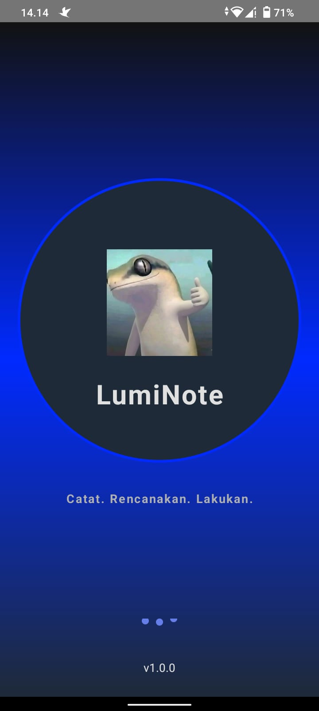

</td>

<td align="center">

### Login

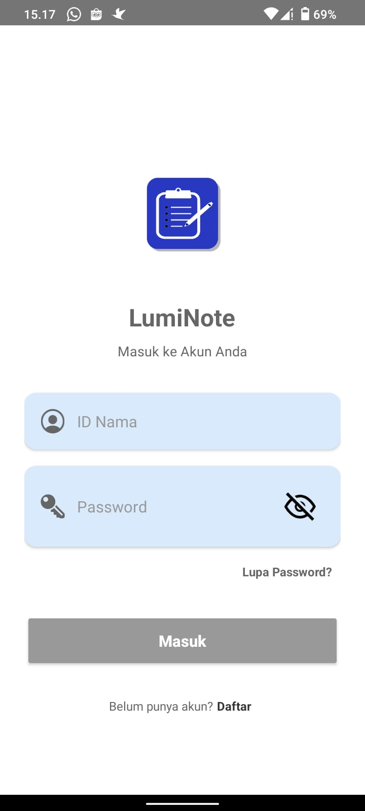

</td>

<td align="center">

### Register

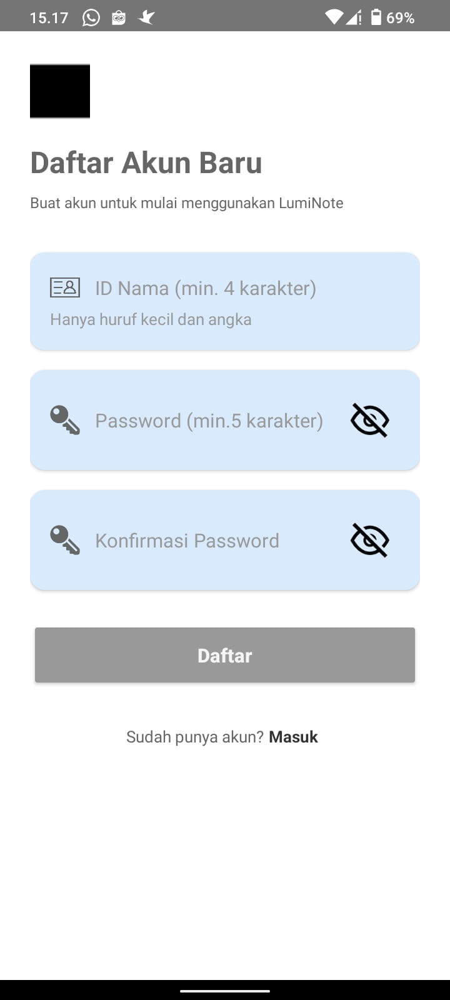

</td>

</tr>

</table>

<br>

---

## 🏠 Halaman Utama

<table>

<tr>

<td align="center">

### Catatan

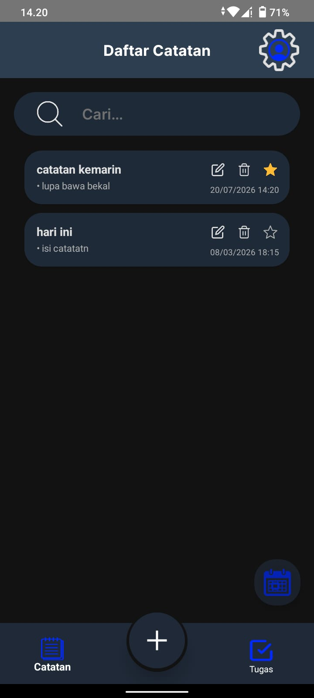

</td>

<td align="center">

### Tugas

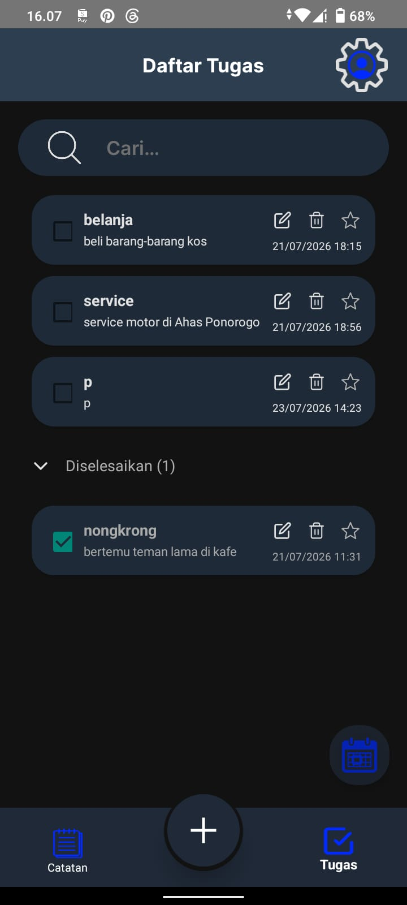

</td>

</tr>

</table>

<br>

---

## 📅 Organisasi Aktivitas

<table>

<tr>

<td align="center">

### Kalender

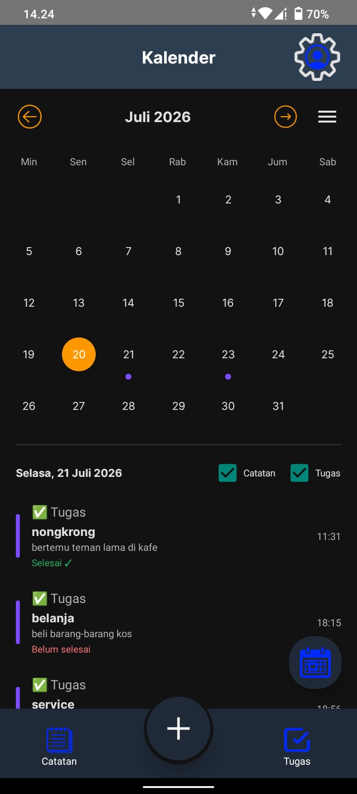

</td>

<td align="center">

### Kalender Detail

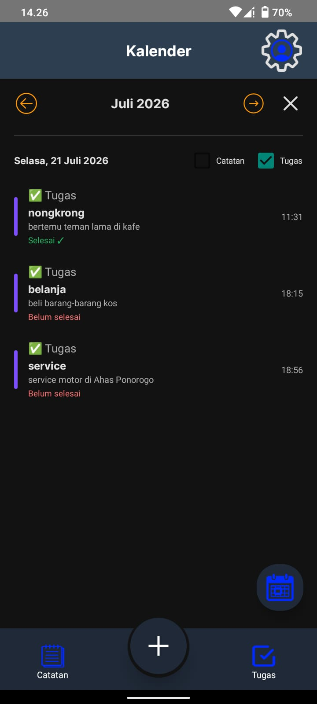

</td>

<td align="center">

### Statistik

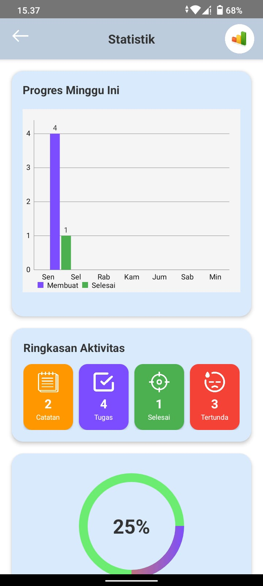

</td>

</tr>

</table>

<br>

---

## 👤 Personalisasi

<table>

<tr>

<td align="center">

### Profil

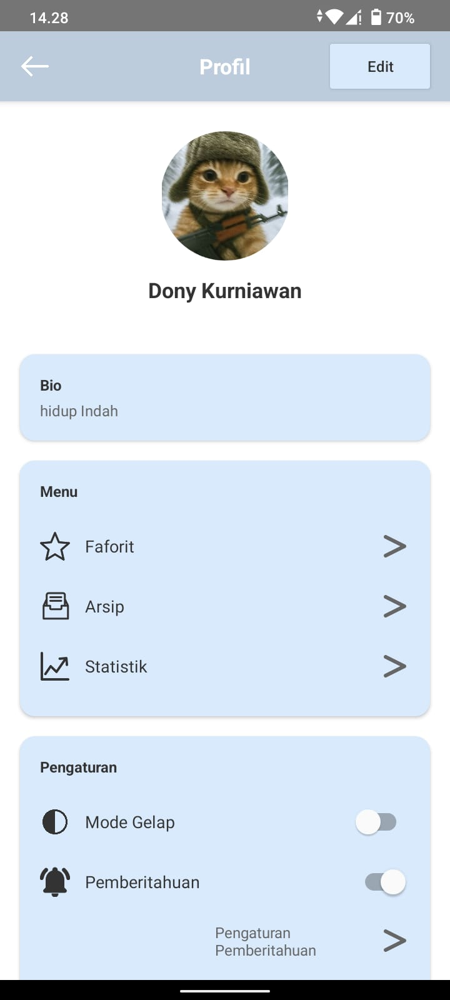

</td>

<td align="center">

### Profil

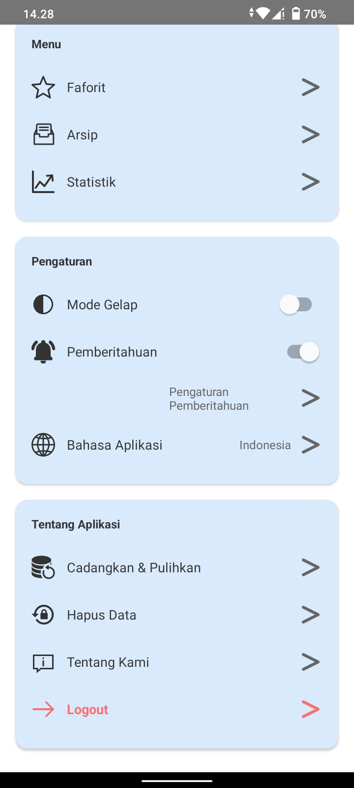

</td>

<td align="center">

### Edit Profil

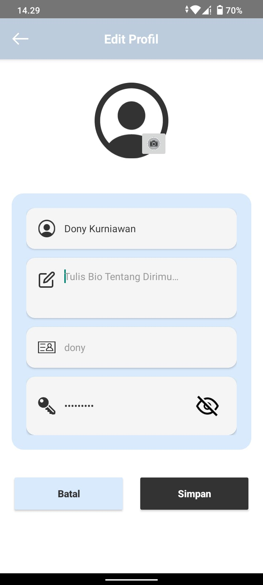

</td>

</tr>

</table>

<br>

---

## 🌙 Tampilan Aplikasi

<table>

<tr>

<td align="center">

### Light Mode

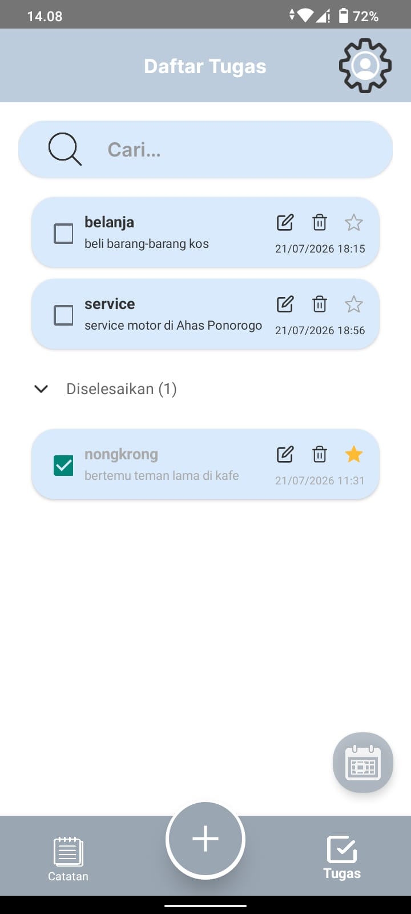

</td>

<td align="center">

### Dark Mode


</td>

</tr>

</table>

</div>

---

# 🛠️ Teknologi yang Digunakan

<div align="center">

| Teknologi | Deskripsi |
|------------|-------------------------------|
| ☕ Kotlin | Bahasa Pemrograman Android |
| 🏗️ MVVM | Architecture Pattern |
| 💾 Room Database | Database Lokal |
| 🎨 Material Design | User Interface |
| 🔔 AlarmManager | Reminder & Alarm |
| 📱 Notification Manager | Notifikasi |
| 🗂️ RecyclerView | Menampilkan Data |
| 🖼️ Image Picker | Memilih Foto Profil |
| 📁 File Picker | Upload File Gambar |
| 📅 CalendarView | Kalender Interaktif |
| 📊 MPAndroidChart | Diagram Statistik |
| 💾 SharedPreferences / DataStore | Penyimpanan Pengaturan |

</div>

---

> 📌 **Selanjutnya pada Bagian 2**, dokumentasi akan membahas seluruh fitur aplikasi secara detail, mulai dari **Catatan, Tugas, Kalender, Favorit, Arsip, Statistik, Profil, Pengaturan, Alarm, Bahasa, Backup & Restore, hingga Tentang Aplikasi**.

# 🚀 Fitur Lengkap Luminote

Luminote menghadirkan berbagai fitur untuk membantu pengguna mengelola aktivitas harian dengan lebih produktif, mulai dari mencatat ide sederhana hingga mengatur tugas dengan pengingat otomatis.

---

# 📝 Catatan (Notes)


Menu **Catatan** digunakan untuk menyimpan berbagai informasi penting seperti ide, jadwal, maupun catatan harian.

### ✨ Fitur

- ➕ Menambahkan catatan baru
- ✏️ Mengedit catatan
- 🗑️ Menghapus catatan
- ⭐ Menandai sebagai Favorit
- 📂 Mengarsipkan catatan
- 📅 Menampilkan tanggal pembuatan
- 📌 Terintegrasi dengan Kalender

> 💡 **Tips**
>
> Catatan yang dibuat akan otomatis ditampilkan pada kalender menggunakan indikator kecil di setiap tanggal.

<br clear="right"/>

---

# ✅ Manajemen Tugas (Task)


Kelola seluruh pekerjaan dalam satu tempat.

### Fitur

- ➕ Tambah tugas
- ✏️ Edit tugas
- 🗑️ Hapus tugas
- 📅 Menentukan deadline
- ✔️ Tandai selesai
- ⌛ Tandai belum selesai
- ⭐ Simpan ke Favorit
- 📂 Arsipkan tugas
- 🔔 Tambahkan Reminder

### 🔄 Alur Reminder

```text
Tambah Tugas
      │
      ▼
Atur Deadline
      │
      ▼
Tambahkan Reminder
      │
      ▼
Alarm Berbunyi
      │
      ▼
Notifikasi Muncul
      │
      ▼
Selesaikan Tugas
      │
      ▼
Masuk Statistik
```

> 📌 Jika reminder aktif, aplikasi akan membunyikan alarm sesuai waktu yang telah ditentukan.

<br clear="right"/>

---

# 📅 Kalender Interaktif

<div align="center">


</div>

Kalender menjadi pusat seluruh aktivitas pengguna.

### Kalender akan menampilkan

🔵 Catatan

🔴 Tugas

⏰ Deadline Tugas

📅 Aktivitas berdasarkan tanggal

### Keunggulan

✔ Mudah melihat aktivitas harian

✔ Menampilkan seluruh jadwal dalam satu tampilan

✔ Deadline terlihat langsung pada kalender

---

# ⭐ Favorit

Menu **Favorit** digunakan untuk menyimpan aktivitas yang dianggap penting.

### Yang dapat disimpan

- ⭐ Catatan Favorit
- ⭐ Tugas Favorit

### Keuntungan

- Lebih cepat diakses
- Tidak perlu mencari dari daftar panjang

---

# 📂 Arsip

Arsip berfungsi untuk menyimpan data tanpa menghapusnya.

### Fitur

- 📄 Arsip Catatan
- ✅ Arsip Tugas
- 🔄 Pulihkan Data
- 🗑️ Hapus Permanen

> 💡 Sangat cocok digunakan untuk menyimpan tugas lama tanpa memenuhi halaman utama.

---

# 📊 Statistik Produktivitas

<div align="center">


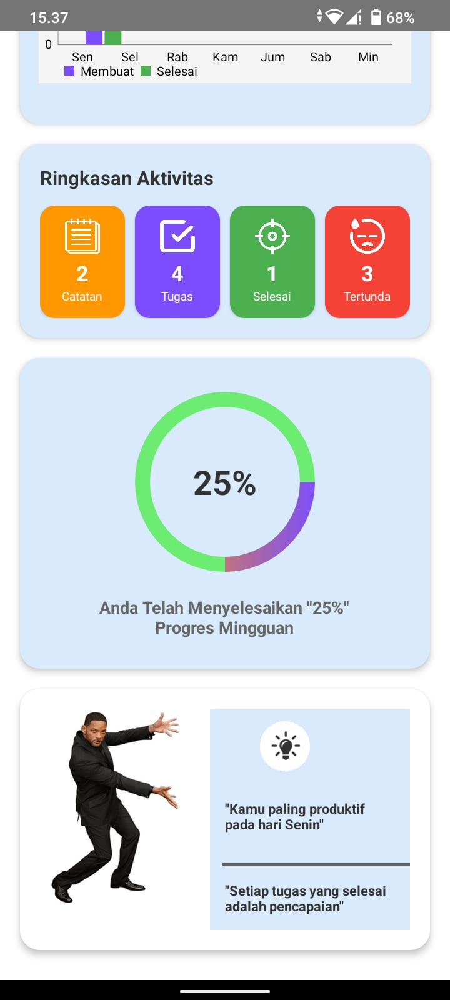

</div>

Luminote membantu pengguna mengetahui tingkat produktivitas selama **7 hari terakhir**.

### Ringkasan Aktivitas

- 📝 Total Catatan
- ✅ Total Tugas
- ✔️ Tugas Selesai
- ⌛ Tugas Belum Selesai

### Pesan Interaktif

Jika produktivitas tinggi

> 🔥 Hebat! Anda sangat aktif minggu ini.

Jika produktivitas sedang

> 🌟 Produktivitas Anda meningkat. Terus semangat!

Jika produktivitas rendah

> 💪 Ayo mulai selesaikan tugas Anda hari ini!

---

# 👤 Profil

<div align="center">


</div>

Pengguna dapat mengubah informasi akun kapan saja.

### Data yang dapat diubah

📷 Foto Profil

👤 Nama

📝 Bio

🆔 Username

🔒 Password

Foto profil dapat dipilih dari:

- Galeri
- Upload File

---

# ⚙️ Pengaturan

Menu Pengaturan memungkinkan pengguna menyesuaikan aplikasi sesuai kebutuhan.

## 🌙 Tema

- ☀ Light Mode
- 🌙 Dark Mode

Perubahan tema diterapkan secara langsung.

---

## 🔔 Pengaturan Notifikasi

Pengguna dapat mengaktifkan maupun menonaktifkan notifikasi.

### Saat Aktif

Muncul pengaturan lanjutan.

- 📢 Pemberitahuan
- ⏳ Tugas Mendatang
- 🚨 Tugas Terlambat

### Saat Nonaktif

Semua pengaturan lanjutan akan disembunyikan agar tampilan lebih sederhana.

---

# ⏰ Pengaturan Alarm

Pengguna memiliki kontrol penuh terhadap alarm.

### Preferensi Alarm

🎵 Nada Dering

📳 Getar

🔁 Pengulangan

🏷 Label Alarm

🔊 Volume

🌙 Jangan Ganggu

### Mode Pengulangan

- Harian
- Hari Kerja
- Akhir Pekan
- Kustom

### Volume

Menggunakan slider horizontal.

Saat digeser

✔ Volume berubah secara langsung

✔ Nada contoh diputar otomatis

---

# 🌐 Multi Bahasa

Luminote mendukung tiga bahasa.

🇮🇩 Indonesia

🇯🇼 Jawa

🇺🇸 English

Perubahan bahasa dapat dilakukan kapan saja melalui menu Pengaturan.

---

# 💾 Backup & Restore

Melindungi data pengguna agar tidak hilang.

### Fitur

✔ Backup Data

✔ Restore Data

✔ Memindahkan data ke perangkat lain

---

# 🗑️ Hapus Data

Menghapus seluruh data aplikasi.

Sebelum menghapus, sistem akan meminta konfirmasi untuk mencegah kesalahan.

---

# 📤 Bagikan Aplikasi

Luminote dapat dibagikan melalui:

- 📦 File APK
- 🔗 Link Download
- 📋 Salin Link

---

# ℹ Tentang Aplikasi

Berisi informasi mengenai aplikasi.

### Menu

💻 Source Code GitHub

📱 WhatsApp Developer

📷 Instagram Developer

ℹ Informasi Versi Aplikasi

---

# 🚪 Logout

Logout dilakukan secara aman.

Setelah logout pengguna akan diarahkan kembali ke halaman Login.

---

# 📱 Seluruh Halaman Aplikasi

| Halaman | Status |
|----------|--------|
| 🚀 Splash Screen | ✅ |
| 🔐 Login | ✅ |
| 📝 Register | ✅ |
| 🏠 Beranda | ✅ |
| 📝 Catatan | ✅ |
| ✅ Tugas | ✅ |
| 📅 Kalender | ✅ |
| ⭐ Favorit | ✅ |
| 📂 Arsip | ✅ |
| 📊 Statistik | ✅ |
| 👤 Profil | ✅ |
| ⚙ Pengaturan | ✅ |
| 🔔 Pengaturan Notifikasi | ✅ |
| ⏰ Pengaturan Alarm | ✅ |
| 🌐 Bahasa | ✅ |
| 💾 Backup & Restore | ✅ |
| 📤 Bagikan Aplikasi | ✅ |
| 🚪 Logout | ✅ |

---

# 🏗️ Arsitektur Aplikasi

Luminote dikembangkan menggunakan pola arsitektur **MVVM (Model - View - ViewModel)** agar kode lebih terstruktur, mudah dikembangkan, dan mudah dipelihara.

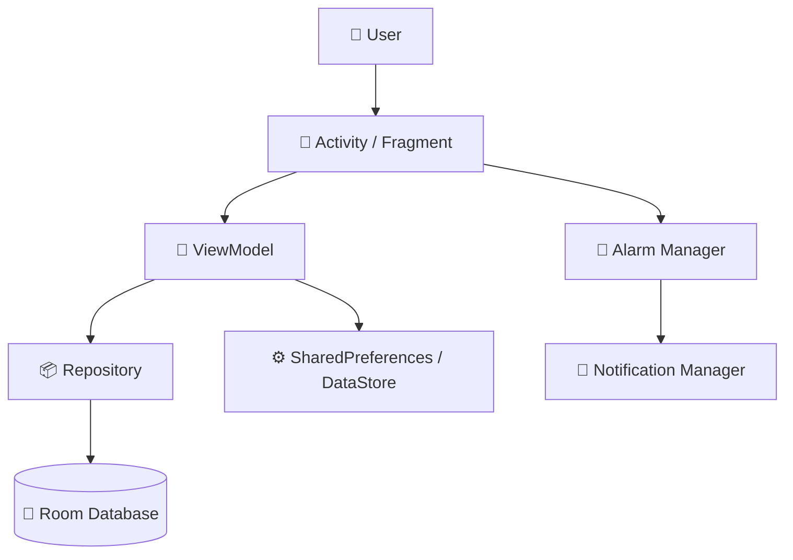

---

# 📂 Struktur Project

```text
📂 features
├── auth
├── notes
├── task
├── calendar
├── favorite
├── archive
├── statistics
├── settings
└── profile
```

---

# ⚙️ Persyaratan Sistem

Sebelum menjalankan project, pastikan perangkat telah memiliki:

| Software | Versi |
|-----------|--------|
| Android Studio | Hedgehog atau lebih baru |
| Kotlin | Terbaru |
| Gradle | Sesuai Project |
| Android SDK | API 24+ |
| JDK | 17 |

---

# 🚀 Cara Menjalankan Project

### 1️⃣ Clone Repository

```bash
git clone https://github.com/kurniawan-Donn/Luminote.git
```

### 2️⃣ Masuk ke Folder Project

```bash
cd Luminote
```

### 3️⃣ Buka Menggunakan Android Studio

```
File
→ Open
→ Pilih Folder Project
```

### 4️⃣ Tunggu Gradle Sync

Android Studio akan mengunduh seluruh dependency secara otomatis.

### 5️⃣ Jalankan Aplikasi

Klik tombol ▶ **Run**

atau tekan

```
Shift + F10
```

---

# 🛠️ Tech Stack

<div align="center">

| Technology | Digunakan Untuk |
|------------|----------------|
| ☕ Kotlin | Bahasa Pemrograman |
| 🏗 MVVM | Architecture |
| 💾 Room Database | Penyimpanan Data |
| 📱 RecyclerView | List Data |
| 📅 CalendarView | Kalender |
| 🔔 AlarmManager | Reminder |
| 📲 NotificationManager | Notifikasi |
| 🖼 Image Picker | Foto Profil |
| 📁 File Picker | Upload Gambar |
| 🎨 Material Design | UI Modern |
| 📊 MPAndroidChart | Statistik |

</div>

---

# 📈 Alur Penggunaan Aplikasi

```text
            Login
              │
              ▼
         Halaman Utama
              │
      ┌───────┴────────┐
      ▼                ▼
  Catatan           Tugas
      │                │
      ▼                ▼
 Kalender         Reminder
      │                │
      └──────┬─────────┘
             ▼
        Statistik
             │
             ▼
        Produktivitas
```

---

# 🌟 Keunggulan Luminote

✔️ Tampilan Modern

✔️ Mudah Digunakan

✔️ Ringan

✔️ Offline

✔️ Reminder Otomatis

✔️ Kalender Interaktif

✔️ Statistik Produktivitas

✔️ Backup & Restore

✔️ Multi Bahasa

✔️ Tema Terang & Gelap

✔️ Pengaturan Alarm Lengkap

✔️ Profil yang Dapat Disesuaikan

---

# 🗺️ Roadmap

### Fitur yang telah tersedia

- [x] Catatan
- [x] Tugas
- [x] Reminder
- [x] Kalender
- [x] Favorit
- [x] Arsip
- [x] Statistik
- [x] Profil
- [x] Tema Gelap
- [x] Multi Bahasa
- [x] Backup & Restore
- [x] Share APK

### Pengembangan Selanjutnya

- [ ] Sinkronisasi Cloud
- [ ] Login Google
- [ ] Widget Android
- [ ] Export PDF
- [ ] Export Excel
- [ ] Voice Notes
- [ ] Fingerprint Authentication
- [ ] AI Smart Reminder

---

# 🤝 Kontribusi

Kontribusi sangat terbuka.

Jika ingin membantu pengembangan project ini silakan:

1. Fork repository
2. Buat branch baru

```bash
git checkout -b feature/NamaFitur
```

3. Commit perubahan

```bash
git commit -m "Menambahkan fitur baru"
```

4. Push

```bash
git push origin feature/NamaFitur
```

5. Buat Pull Request

---

# 📄 Lisensi

Project ini dibuat sebagai media pembelajaran dan pengembangan aplikasi Android.

Silakan menggunakan, memodifikasi, maupun mengembangkan project ini dengan tetap mencantumkan atribusi kepada pengembang.

---

# 👨‍💻 Developer

<div align="center">

## Dony Kurniawan

Android Developer • Kotlin Enthusiast

💻 GitHub

https://github.com/kurniawan-Donn

<br>

Terima kasih telah mengunjungi repository ini 🙌

Jika project ini bermanfaat,

⭐ **Jangan lupa berikan Star pada repository ini.**

<br>

Made with ❤️ using Kotlin & Android Studio

</div>
